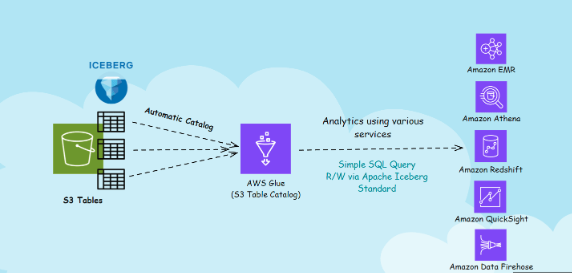
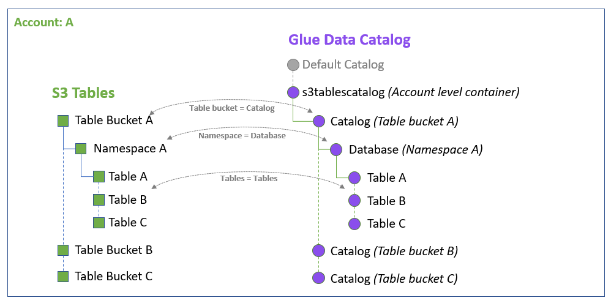

### 1. Giới thiệu

#### Khái niệm về Amazon S3 và S3 Tables  

**Amazon Simple Storage Service (Amazon S3)** là dịch vụ lưu trữ đối tượng hàng đầu với khả năng mở rộng, tính sẵn sàng cao, và bảo mật tối ưu. Amazon S3 được ứng dụng trong nhiều trường hợp như lưu trữ data lakes, website, ứng dụng di động, sao lưu, khôi phục, và phân tích dữ liệu lớn.  

Trong workshop này, chúng ta sẽ tập trung vào **Amazon S3 Tables**, một giải pháp lưu trữ dữ liệu dạng bảng tối ưu hóa cho phân tích quy mô lớn, đặc biệt phù hợp với dữ liệu giao dịch hàng ngày hoặc xử lý streaming data.  

**Lợi ích của Amazon S3 Tables**:  
- **Hiệu suất cao**: Truy vấn nhanh hơn 3 lần so với các dịch vụ tự quản lý.  
- **Tối ưu hóa xử lý**: Hỗ trợ giao dịch nhiều hơn 10 lần.  
- **Tự động hóa vận hành**: Giảm tải công việc quản trị nhờ tích hợp hoàn chỉnh từ Amazon.  

Ngoài ra, Amazon S3 Tables hỗ trợ định dạng **Apache Iceberg** – phổ biến trong quản lý file Parquet – và được sử dụng rộng rãi bởi hàng nghìn khách hàng AWS để truy vấn hàng triệu tệp dữ liệu với dung lượng từ petabyte đến exabyte.  

#### Các thành phần chính trong S3 Tables  

1. **Table Buckets**: Loại bucket đặc biệt dành cho lưu trữ dữ liệu phân tích, hỗ trợ quản lý các bảng **Iceberg** với nhiều schema khác nhau.  
2. **Tables**: Tập dữ liệu có cấu trúc được tổ chức trong table bucket. Tables được quản lý hoàn toàn với các tính năng tự động như nén dữ liệu, xóa file không được tham chiếu, và quản lý snapshot.  
3. **Namespaces**: Các nhóm table trong bucket, giúp tổ chức và phân loại dữ liệu hiệu quả.  

#### AWS Glue Data Catalog  

**AWS Glue Data Catalog** là kho metadata trung tâm, lưu trữ thông tin về vị trí, lược đồ và thông số runtime của dữ liệu. Glue Data Catalog hoạt động như một index giúp truy vấn dễ dàng và có thể đăng ký làm nguồn dữ liệu trong **Lake Formation**.  

Glue Data Catalog tự động đồng bộ các table buckets, namespaces và tables dưới dạng các đối tượng metadata trong AWS Glue, giúp quản lý dữ liệu đơn giản và hiệu quả.  

#### Các dịch vụ AWS Analytics tích hợp với S3 Tables  

1. [**Amazon Athena**](https://docs.aws.amazon.com/AmazonS3/latest/userguide/s3-tables-integrating-athena.html): Dịch vụ truy vấn SQL tương tác trực tiếp với S3, không cần cài đặt server.  
2. [**Amazon Redshift**](https://docs.aws.amazon.com/AmazonS3/latest/userguide/s3-tables-integrating-redshift.html): Kho dữ liệu petabyte-scale, hỗ trợ phân tích dữ liệu hiệu quả với Redshift Serverless cho phép truy cập mà không cần cấu hình phức tạp.  
3. [**Amazon EMR**](https://docs.aws.amazon.com/AmazonS3/latest/userguide/s3-tables-integrating-emr.html): Nền tảng big data giúp chạy các framework như Apache Hadoop và Spark để xử lý dữ liệu lớn.  
4. [**Amazon QuickSight**](https://docs.aws.amazon.com/AmazonS3/latest/userguide/s3-tables-integrating-quicksight.html): Công cụ phân tích dữ liệu nhanh, cung cấp các biểu đồ trực quan và hỗ trợ mở rộng cho hàng trăm nghìn người dùng với **SPICE Engine**.  
5. [**Amazon Data Firehose**](https://docs.aws.amazon.com/AmazonS3/latest/userguide/s3-tables-integrating-firehose.html): Dịch vụ streaming dữ liệu thời gian thực, tích hợp với S3, Redshift, OpenSearch, và Apache Iceberg Tables.  
