### 2.2. Triển khai Linux Elastic Compute Cloud

#### Tạo Security Group

Security Group hoạt động ở Subnet Level, quản lý inbound và outbound traffic đến tài nguyên bên trong VPC. Trong bài lab này, bạn sẽ:

- Tạo Security Group với inbound rules cho phép **SSH** (Source: MY IP ADDRESS) và **ALL ICMP IPv4** (Source: Everywhere).
- Outbound rules cho phép tất cả traffic.

1. Truy cập **VPC Dashboard** > **Security Groups** > Chọn **Create Security Group**.

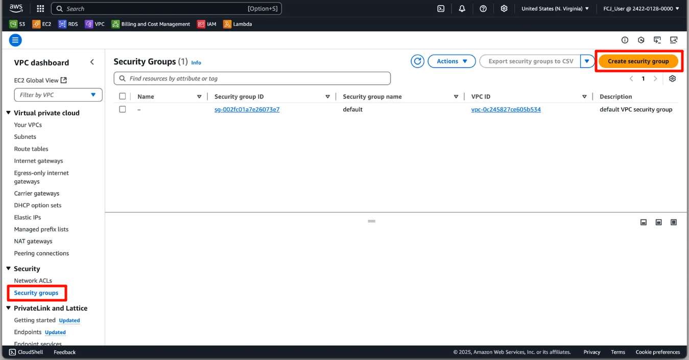

2. Trong giao diện **Create Security Group**:

   - Điền **Security Group name**, **Description**, chọn VPC đã tạo.
   - **Inbound Rules**: Thêm 2 rule:
     - **SSH**: Source là **MY IP ADDRESS**.
     - **ALL ICMP IPv4**: Source là **Everywhere**.
   - **Outbound Rules**: Chọn **All Traffic**.

3. Nhấn **Create Security Group**.

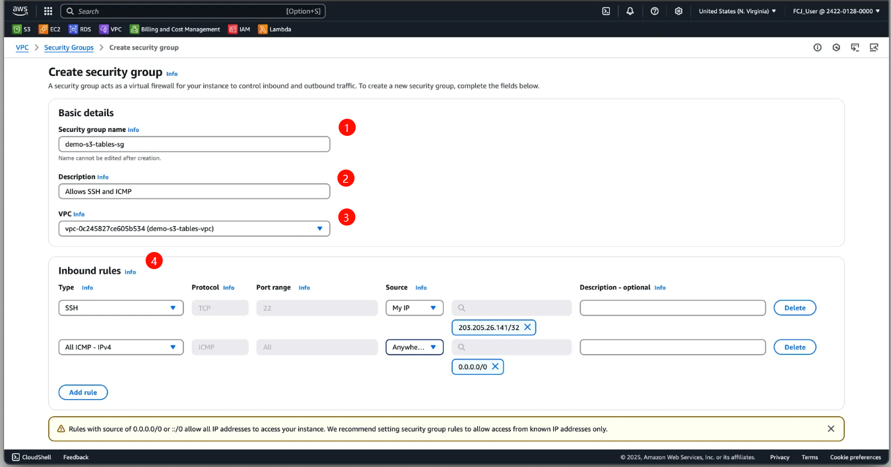
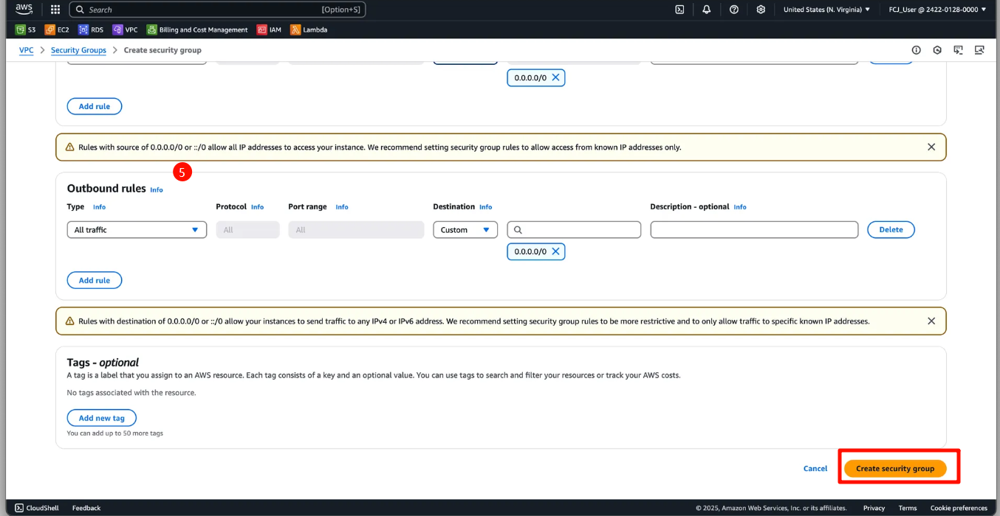

4. Kiểm tra giao diện khi tạo thành công.

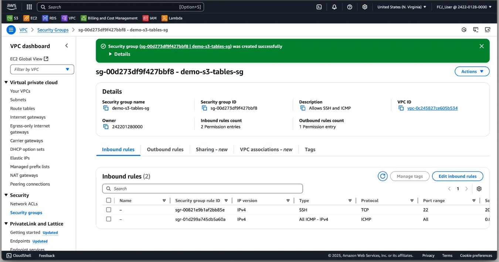

---

#### Triển khai Linux EC2 Instance

{}  
**Lưu ý:** Với mục đích tiết kiệm chi phí, bạn có thể dùng **t2.micro** (Free Tier). Tuy nhiên, nếu triển khai trong **us-east-1**, độ trễ và hiệu năng của instance có thể không đủ để chạy bài lab này. Đề xuất sử dụng **t2.medium** để đảm bảo hiệu năng.  
{}

**Cấu hình EC2 Instance**:

- Loại: **t2.medium**
- Tài nguyên: **2 vCPU**, **4 GB RAM**, Network Bandwidth trung bình.

**Bước triển khai:**

1. Truy cập **EC2 Dashboard** > Nhấn **Launch Instance**.

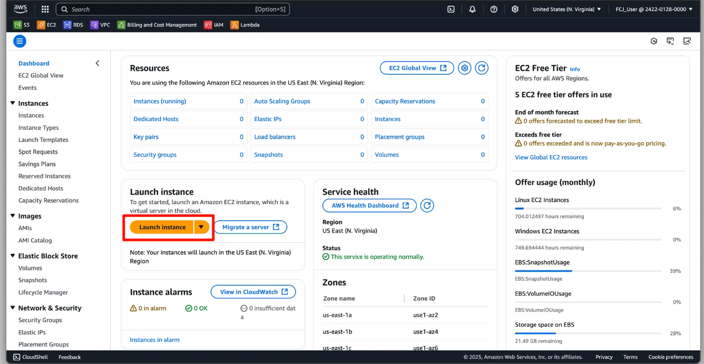

2. Trong giao diện **Launch an Instance**:
   - **Name and Tags**: Nhập tên instance.
   - **Application and OS Images**: Chọn **Amazon Linux 2023 AMI**.
   - **Instance Type**: Chọn **t2.medium**.
   - **Key Pair**: Nhấn **Create New Key Pair**.

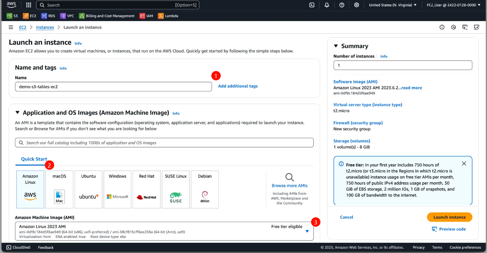

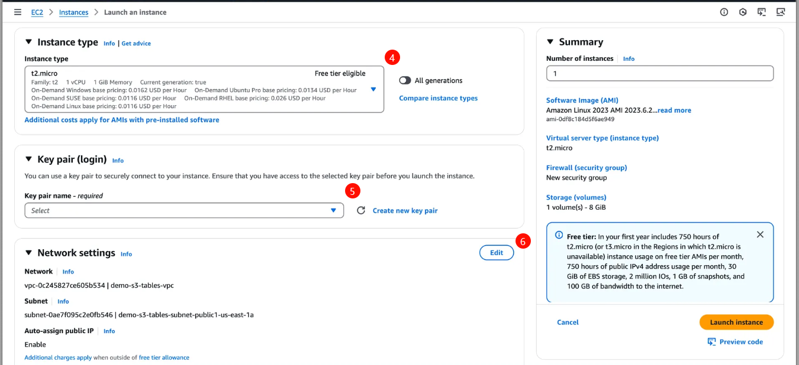

3. Trong giao diện **Create Key Pair**:
   - Điền **Key Pair Name**, chọn **RSA**, định dạng **.pem**.
   - Nhấn **Create Key Pair** và lưu tệp vào thư mục máy của bạn.

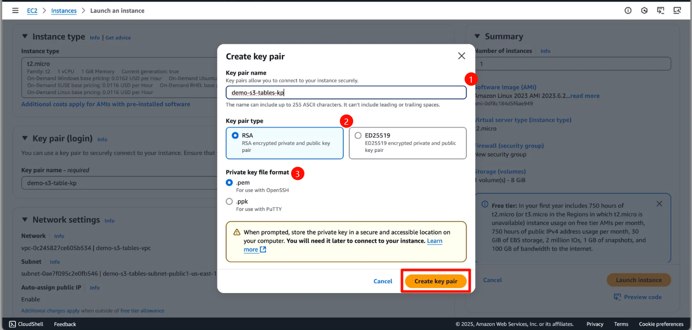

4. **Network Settings**:

   - Chọn **Edit**.
   - **VPC**: Chọn VPC đã tạo.
   - **Subnet**: Chọn subnet **public1**.
   - Bật **Auto-assign public IP**.
   - **Firewall**: Chọn **Security Group** đã tạo.

5. Nhấn **Launch Instance** để khởi tạo.

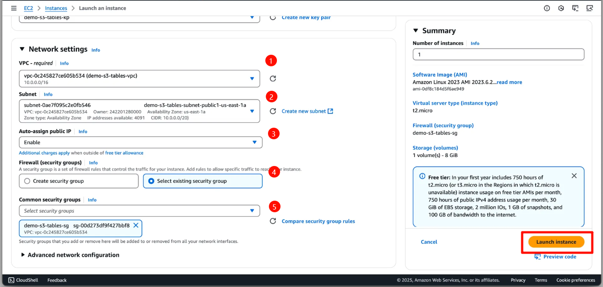

6. Kiểm tra giao diện khi EC2 được tạo thành công.

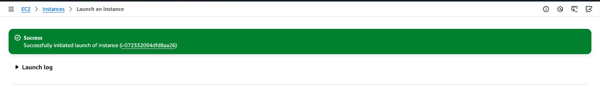

---

#### Kết nối EC2 Instance qua SSH

1. Trong **EC2 Dashboard**, chọn instance vừa tạo, nhấn **Connect**.
2. Trong giao diện **Connect to Instance**, chuyển sang tab **SSH Client** và sao chép lệnh SSH mẫu.

```bash
ssh -i "demo-s3-tables-kp.pem" ec2-user@ec2-<instance-public-ip>.compute-<region>.amazonaws.com
```

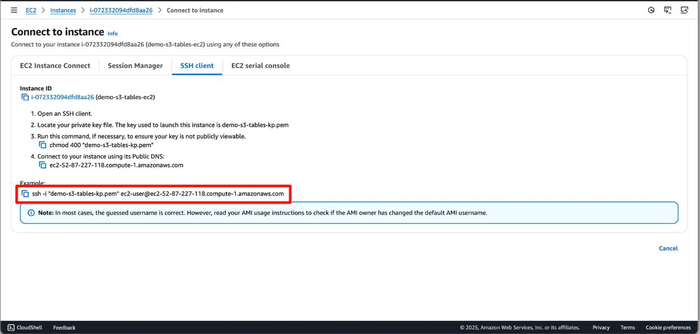

3. Truy cập thư mục chứa key pair đã lưu, dán lệnh vào terminal để kết nối.

4. Xác nhận kết nối thành công.

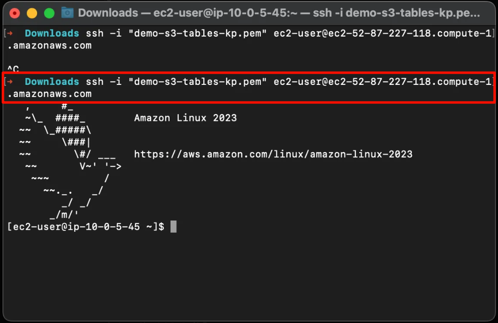

---

#### Tạo IAM Role và gắn vào EC2 Instance

**Bước 1: Tạo IAM Role**

1. Truy cập **IAM Dashboard** > Chọn **Roles** > **Create Role**.

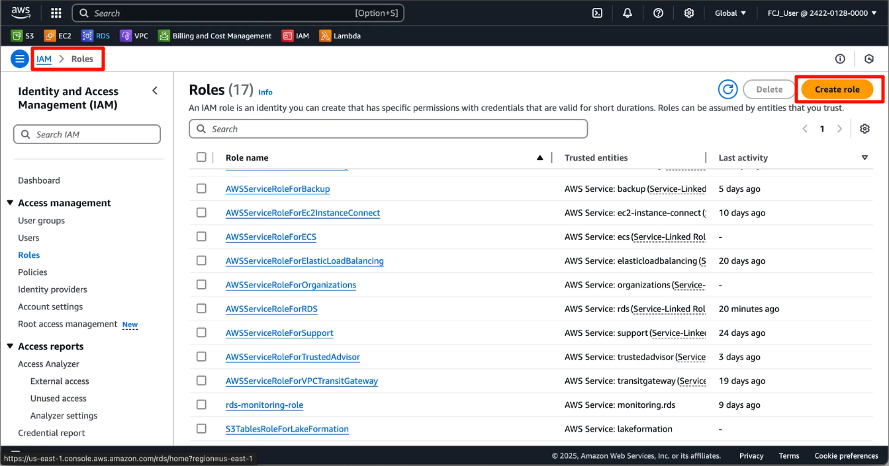

2. Trong **Select Trusted Entity**:
   - Chọn **AWS Service** > Use case: **EC2**.

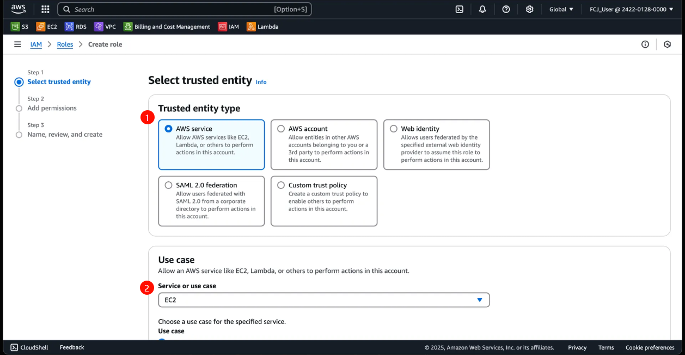

3. Trong **Add Permissions**:
   - Tìm kiếm và thêm quyền **AmazonS3FullAccess** và **AmazonS3TablesFullAccess**.

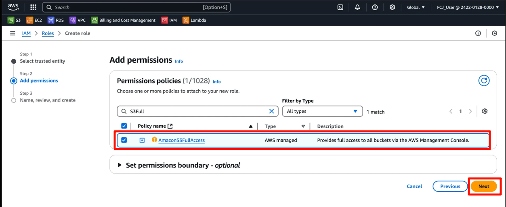

   - Nhấn **Next** để review và đặt tên cho role.

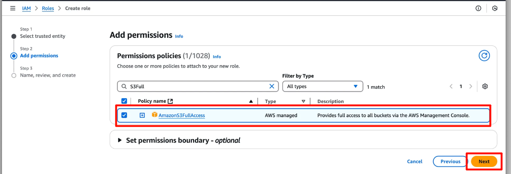

   - Nhấn **Create Role** để hoàn tất.

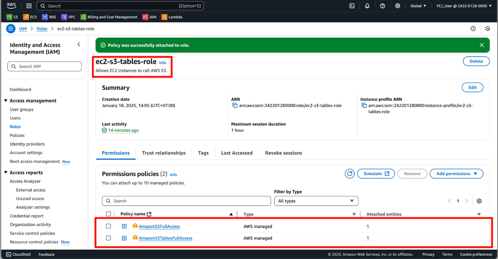


**Bước 2: Attach IAM Role vào EC2 Instance**

1. Truy cập chi tiết EC2 Instance, chọn **Actions** > **Security** > **Modify IAM Role**.

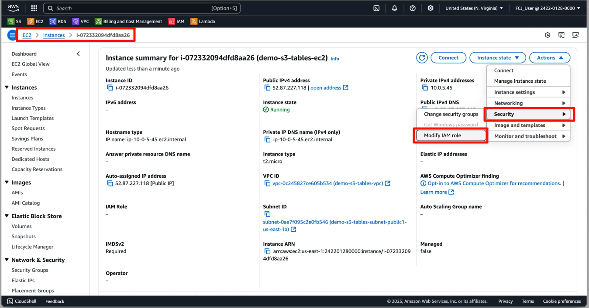

2. Trong giao diện **Modify IAM Role**, chọn role vừa tạo > Nhấn **Update IAM Role**.

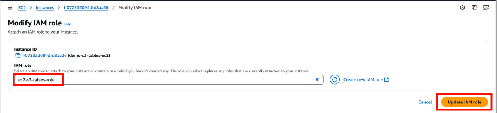

3. Kiểm tra giao diện khi gắn IAM Role thành công.

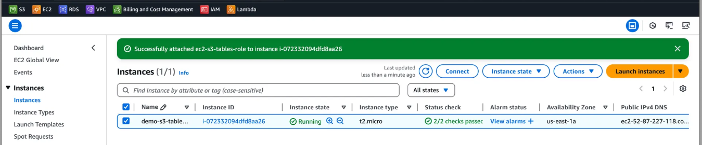