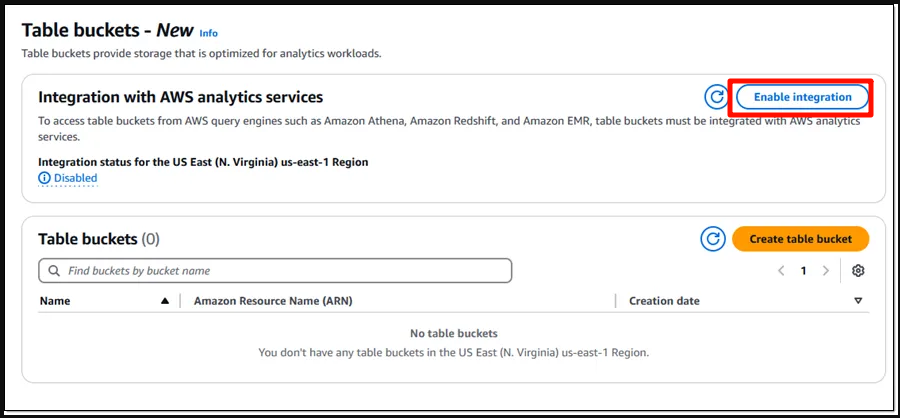
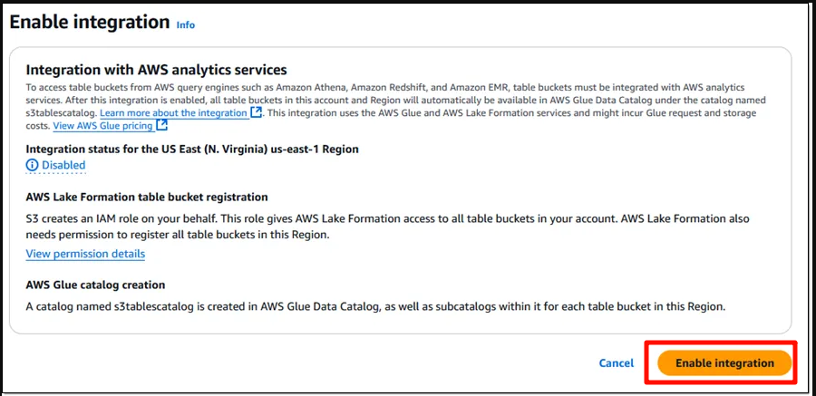
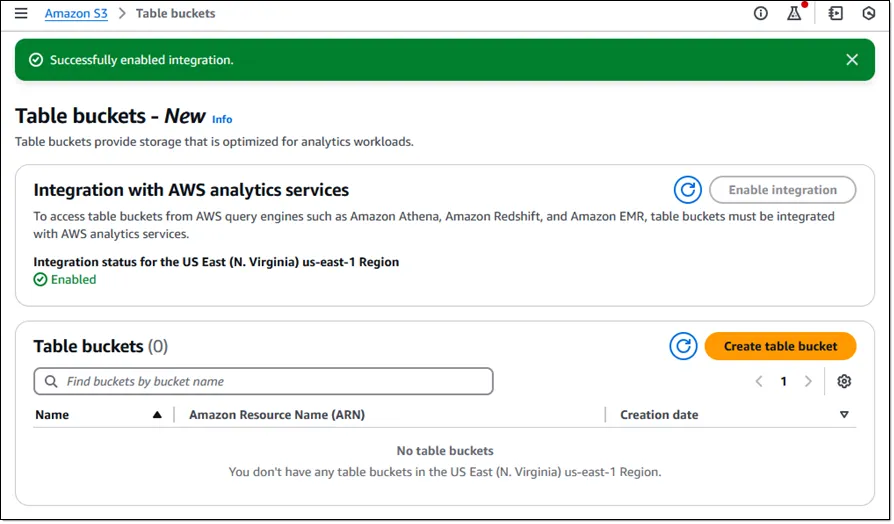
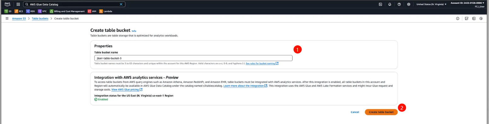
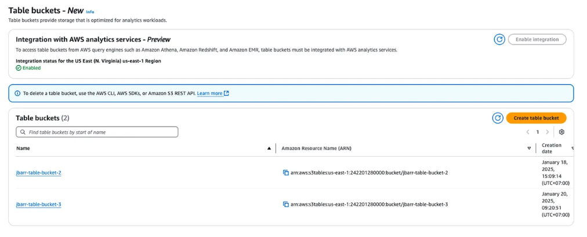
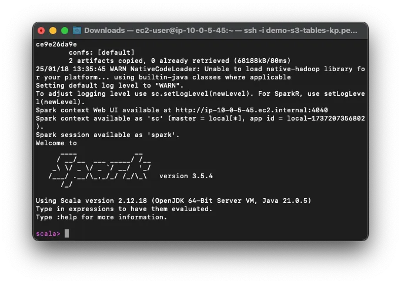
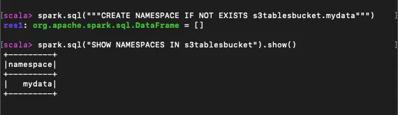
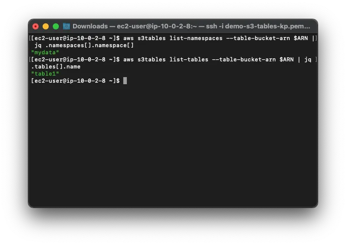
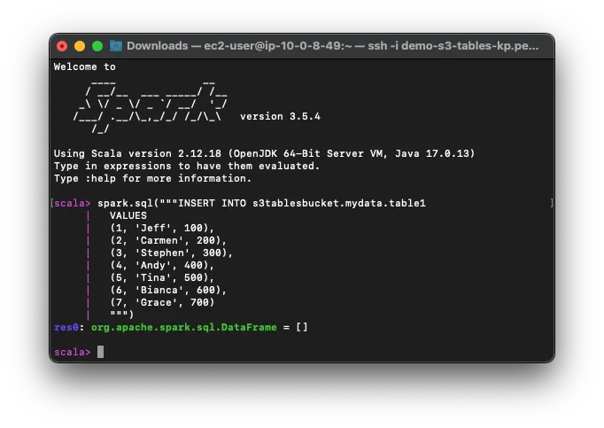
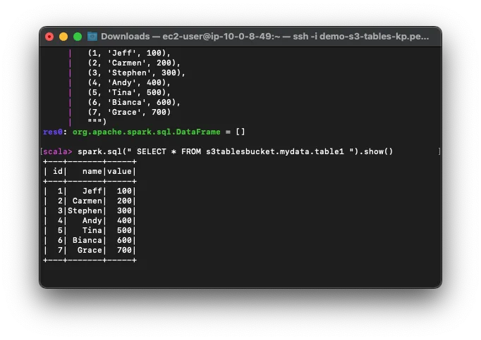

### 4. Truy cập S3 Buckets và Tables sử dụng AWS Management Console

#### Tạo S3 Bucket qua AWS Management Console

1. **Truy cập Amazon S3**  
   Đăng nhập vào AWS Management Console, sau đó chọn **Table Buckets** từ thanh điều hướng bên trái.

   

2. **Kích hoạt tích hợp dịch vụ**  
   Trước khi tạo Bucket, hãy nhấn **Enable Integration** để kích hoạt tích hợp S3 Tables với các dịch vụ phân tích dữ liệu của AWS.

   

   Khi quá trình tích hợp hoàn tất, giao diện sẽ hiển thị trạng thái **Integration enabled**.

   

3. **Tạo Table Bucket**  
   Nhấn **Create Table Bucket**, nhập **Table Bucket Name** trong giao diện cấu hình, sau đó nhấn **Create Table** để hoàn tất.

   

4. **Xác minh Bucket vừa tạo**  
   Kiểm tra danh sách các Table Buckets để xác nhận Bucket của bạn đã được tạo thành công.

   

---

#### Thao tác với Bucket sử dụng Apache Spark

Để làm việc với Table Bucket đã tạo, bạn có thể sử dụng Apache Spark như các bước đã làm ở [Section 3](../3-accessing-buckets-and-tables-via-command-line/#cài-đặt-và-sử-dụng-apache-spark-để-quản-lý-tables). Truy cập SSH vào EC2 Instance và khởi chạy Spark-Shell với các gói cần thiết.

1. **Truy cập Spark-Shell**

   Sử dụng lệnh dưới đây, thay thế `<aws:s3tables:us-east-1:0123456789012:bucket/jbarr-table-bucket-3>` bằng ARN của Table Bucket bạn đã tạo:

   ```bash
   spark-shell \
   --packages org.apache.iceberg:iceberg-spark-runtime-3.5_2.12:1.6.1,software.amazon.s3tables:s3-tables-catalog-for-iceberg-runtime:0.1.3,software.amazon.awssdk:s3:2.20.42,software.amazon.awssdk:sts:2.20.42,software.amazon.awssdk:kms:2.20.42,software.amazon.awssdk:glue:2.20.42,software.amazon.awssdk:dynamodb:2.20.42 \
   --conf spark.sql.catalog.s3tablesbucket=org.apache.iceberg.spark.SparkCatalog \
   --conf spark.sql.catalog.s3tablesbucket.catalog-impl=software.amazon.s3tables.iceberg.S3TablesCatalog \
   --conf spark.sql.catalog.s3tablesbucket.warehouse=<aws:s3tables:us-east-1:0123456789012:bucket/jbarr-table-bucket-3> \
   --conf spark.sql.extensions=org.apache.iceberg.spark.extensions.IcebergSparkSessionExtensions
   ```

   

2. **Tạo Namespace**  
   Dùng lệnh sau để tạo namespace (ví dụ: `mydata`):

   ```scala
   spark.sql("""CREATE NAMESPACE IF NOT EXISTS s3tablesbucket.mydata""")
   spark.sql("SHOW NAMESPACES IN s3tablesbucket").show()
   ```

   

3. **Tạo Table**  
   Tạo bảng trong namespace đã tạo:

   ```scala
   spark.sql("""CREATE TABLE IF NOT EXISTS s3tablesbucket.mydata.table1
   (id INT,
    name STRING,
    value INT)
   USING iceberg
   """)
   ```

   

4. **Thêm dữ liệu mẫu**  
   Chèn dữ liệu mẫu vào bảng:

   ```scala
   spark.sql("""INSERT INTO s3tablesbucket.mydata.table1
     VALUES
     (1, 'Alice', 100),
     (2, 'Bob', 200),
     (3, 'Charlie', 300)
     """)
   ```

   <

5. **Truy vấn dữ liệu**  
   Truy vấn dữ liệu từ bảng để kiểm tra:

   ```scala
   spark.sql("SELECT * FROM s3tablesbucket.mydata.table1").show()
   ```

   

---

Bằng cách sử dụng **AWS Management Console và Apache Spark**, bạn có thể dễ dàng tạo và thao tác với các Table Buckets trên Amazon S3. Điều này mang đến khả năng lưu trữ, xử lý và phân tích dữ liệu lớn hiệu quả hơn.